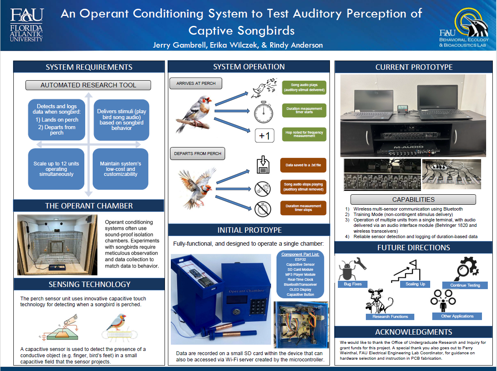
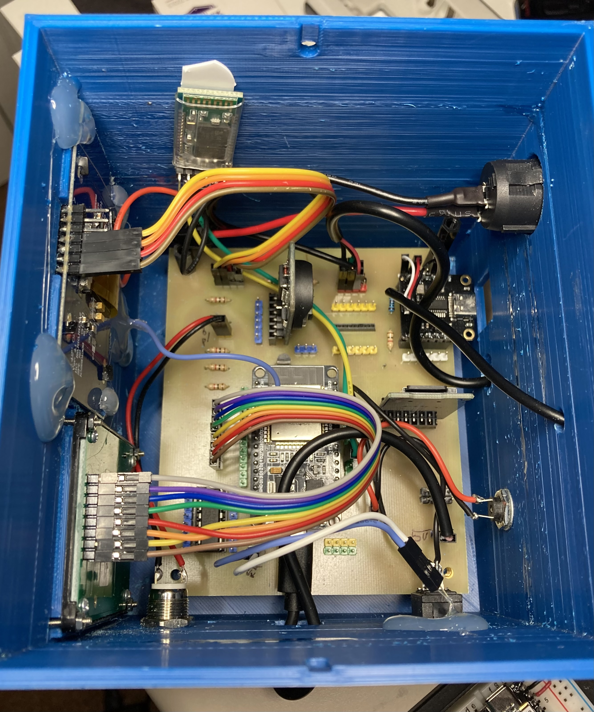
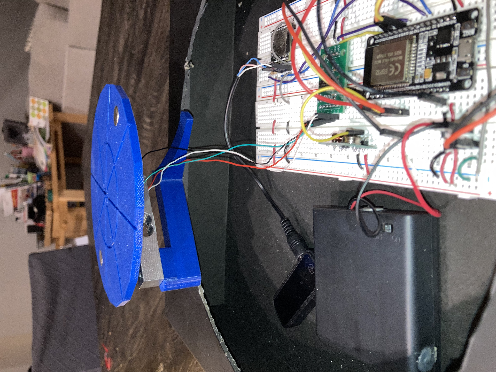
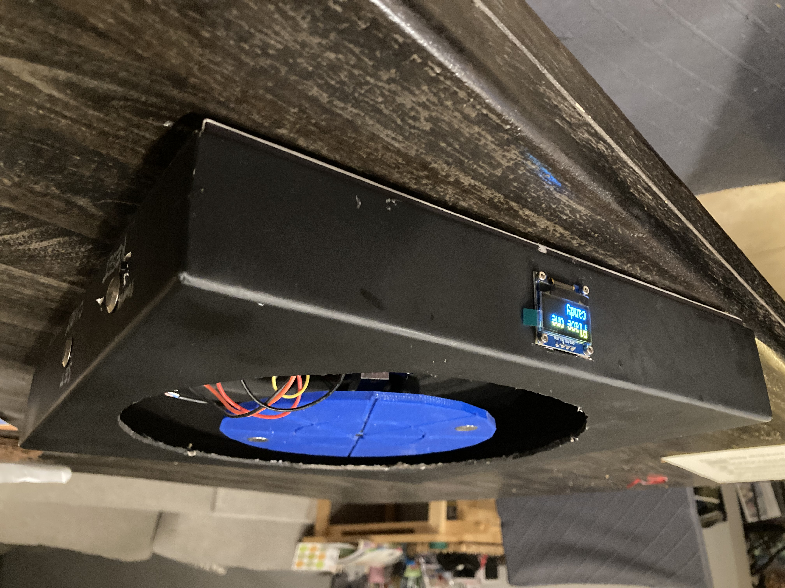

# jg-projects

## About me
My name is Jerry Gambrell, and I am currently a graduate student at Florida Atlantic University in the Master's of Science in Artificial Intelligence program. I recently graduated from FAU with a Bachelor's in Electrical Engineering (December '24), and also hold an advanced degree and certification in Psychology and human behavior. Although my primary areas of interest lie in robotics and embedded systems design, I have completed undergraduate and graduate coursework in areas such as Circuit Analysis, Control Systems, Electronics, Sensor Networking and Smart Systems, Logic Design, and Tissue Engineering. In addition, I took a "project-based" approach to my education, volunteering for research projects whenever possible; while also exploring several interesting personal projects related to embedded systems and robotics in my free time. As a result, I also have experience in circuit board design, smd soldering, 3-D printing, and general protoyping of electronic devices. My long-term goal involves eventually combining my knowledge of technology and human behavior to develop products that will enhance the lives of everyday people.

## About this repository
This repository is a compilation of embedded systems, robotics, and machine learning projects that have been completed over the past four years for engineering/computer science coursework, or as personal pursuits. It is meant to provide some insight into the various projects which I have undertaken, and the skills and techniques that were used in order to complete them. Projects will be divided into two categories: Those that are university-related (as part of academic coursework or volunteer project), and those completed as personal projects or as an independent contractor.
   

# List of Projects:

## University-Related:
- [Operant Conditioning System To Test Auditory Perception of Songbirds](#Operant-Conditioning-System-To-Test-Auditory-Perception-of-Songbirds)
- Car Seat
- Thesis
- Senior Design Project (ROS)
- Medical Alert Device

## Personal Projects:
- Consumer Product (toy)
- Johnny 2 and Johnny 1
- [Automated Halloween Candy Bowl](#Automated-Halloween-Candy-Bowl)
- Automatic Gardening Waterer
 

# Project Overviews:

## Operant Conditioning System To Test Auditory Perception of Songbirds
### Description:
 
This project was completed as a volunteer research assistant working directly with the Biology Department at FAU. The purpose of the project was to improve the efficiency of research by designing a custom, semi-autonomous operant conditioning system capable of presenting auditory stimuli to subjects (songbirds), while sensing and logging subject’s resulting behavior (frequency and duration of perching).  This model improves upon other versions that use infrared sensors and trigger switches attached to perches to capture behavioral data, by using an innovative sensing technique for capturing data based on capacitive touch, which is more accurate and avoids many of the pitfalls associated with using other methods.  A “tutoring mode” was also added for subject training with non-contingent stimuli. Initially developed as a single-unit prototype (as seen on poster in Figure 1-A and 1-B), the current version utilizes a single laptop as a hub for interfacing with up to 10 units simultaneously (Figure 1-C). The system was presented and demonstrated at the university's annual research symposium, and is currently undergoing testing of functionality and reliability with songbirds.
    

<!--   NOT USED BECAUSE NEED TO CHANGE PIC SIZE AND MUST USE HTML FOR THAT-->

   

   

<!--  -->
<!--    -->

### Hardware:
### Software:
### Relevant Skills/Methods:

## Automated Halloween Candy Bowl
### Description:
 
This project was conceptualized by my elementary school-aged daughter, with the aim of implementing a halloween candy bowl that could be left out for trick-or-treaters with the ability to limit the amount of candy that was taken at once. Due to the imprecision of basic force sensors, a load cell scale with 3-D printed structure was used to track the weight of the candy in order to track the quantty and dtetect if one, or more than one, candy had been removed at one time. To discourage trick-or-treaters from taking more than one piece of candy at a time, a speaker with a message chastizing their gluttony and threatening them with electrocution via "electric spider" if the extra candy is not immediately retirned to the bowl. If no change to the weight of the candy bowl is detected in the next several seconds audio of an "electric shock" sound is played to wirelss speakers, an a 433 MHz transmitter is used to transmit a message to a digital switch controlling the lights on a large spider web (replete with large fake spider), causing them to blink on and off rapidly.
    

<!-- ****************** Resizing a video may not be possible in this format, but may be able to resize a gif *********************-->

<!-- Video clipped video that is in image folder of halloween bowl (dragged and dropped) -->
https://github.com/user-attachments/assets/aecadc69-6d58-4a7f-9522-04b8eed776f0

   

   

### Hardware:
### Software:
### Relevant Skills/Methods:

