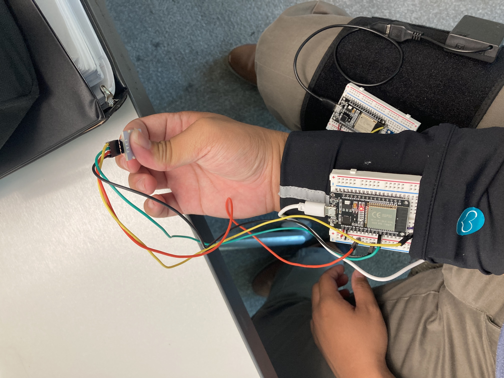
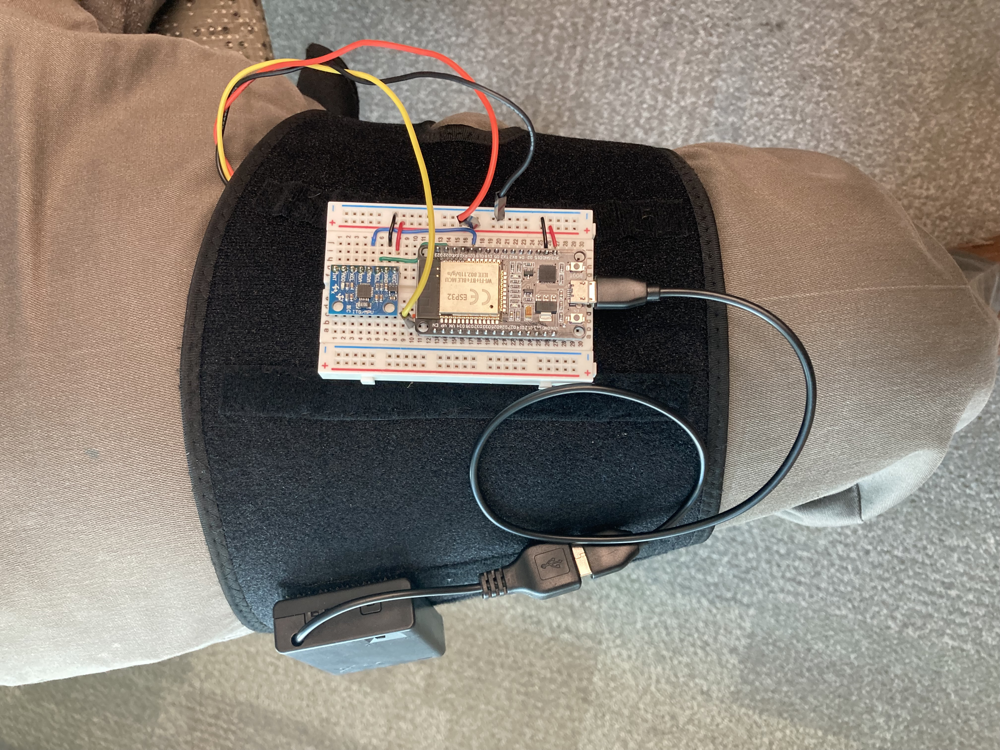
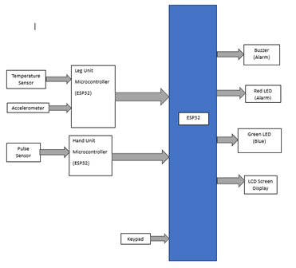

# Jerry Gambrell — Engineering Projects Portfolio

Electrical Engineer and M.S. student in Artificial Intelligence focused on building intelligent physical systems at the intersection of embedded hardware, robotics, and AI.

This repository highlights selected projects spanning embedded systems, robotics, and hybrid intelligent systems, with an emphasis on real-world deployment, system integration, and applied research.

---

## 🔗 Links
- LinkedIn: https://www.linkedin.com/in/jerry-gambrell/
- Resume — Embedded Systems / Hardware: [Download](resumes/Jerry_Gambrell_resume_embedded_hardware_v2.pdf)  
- Resume — Robotics / AI: [Download](resumes/Jerry_Gambrell_resume_robotics_ai_v2.pdf)

---

## ⭐ Featured Projects

### 🔹 VLM-Guided Robot Navigation (Embodied AI Research)
&nbsp;  Development of an embodied AI system enabling robots to interpret and interact with real-world environments using VLMs

- Integrated VLM/LLM reasoning, CLIP-based object localization, and ROS2/Nav2 navigation
- Designed for interaction-aware navigation in environments where traditional planners fail
- Evaluated across simulation (Isaac Sim) and real-world robotic systems
- Research contributing to a paper accepted to CVPR 2026 (extended work submitted to IROS)

---

### 🔹 Operant Conditioning System
&nbsp;  Automated system for behavioral research in biological experiments

- Designed embedded system for behavioral tracking and stimulus delivery
- Scaled from single prototype to 10-unit deployable system
- Improved consistency and automation of experimental data collection
- Presented at university research symposium

---

### 🔹 Personal Monitoring System
&nbsp;  Distributed multi-node wearable monitoring system (wrist, leg, display)

- Real-time motion data acquisition using embedded sensors
- RF-based wireless communication between independent modules
- Modular design enabling scalable and extensible sensor integration

---

### 🔹 JOY Smart Car Seat
&nbsp;  Multi-sensor safety system designed to prevent child endangerment scenarios

- Integrated temperature, gas, moisture, and occupancy sensing
- Implemented GSM-based communication (SIM7000G) for real-time SMS alerts with GPS location
- Local alerting via buzzer and LED
- End-to-end embedded system design and validation

---

### 🔹 Automated Halloween Candy Bowl
- Interactive embedded system using sensor-triggered automation
- Event-driven logic for responsive user interaction
- RF-enabled communication for coordinated behaviors
- Designed for customizable and expandable effects

---

## 📂 Project Index
[jump to project list](#List-of_Projects)

---

# List of Projects:

## University-Related:
- [VLM-Guided Robot Navigation](#VLM-Guided-Robot-Navigation)
- [Autonomous Substation Inspection Robot Model](#Autonomous-Substation-Inspection-Robot-Model)
- [Operant Conditioning System To Test Auditory Perception of Songbirds](#Operant-Conditioning-System-To-Test-Auditory-Perception-of-Songbirds)
- [Smart Car Seat](#Smart-Car-Seat)
- [Medical Alert Device](#Medical-Alert-Device)

## Personal Projects:
- [Automated Halloween Candy Bowl](#Automated-Halloween-Candy-Bowl)
- [Johnny 2 Custom Robotics Platform](#Johnny2-Robotics-Platform)
- [Smart Gardening System](#Smart-Gardening-System)

---

# Project Overviews:

## VLM-Guided Robot Navigation

### Overview:
Embodied AI system integrating perception, reasoning, and navigation to enable robots to operate in complex real-world environments. This work explores how vision-language models (VLMs) can support interaction-aware navigation when traditional planners fail.

### Key Contributions:
- Integrated VLM/LLM reasoning, CLIP-based object localization, and ROS2/Nav2 navigation pipelines
- Designed system architecture for combining perception outputs with actionable navigation decisions
- Deployed and evaluated on real robotic platforms and in simulation (Isaac Sim)
- Research contributing to a paper accepted to CVPR 2026 (extended work submitted to IROS)

### Outcome:
- Demonstrated successful navigation in scenarios requiring environment interpretation and interaction
- Validated approach across simulation and real-world testing

*Example of robot navigation behavior integrating perception and decision-making*

### Implementation Notes
Core functionality is implemented using Python-based ROS2 nodes for perception, reasoning, and navigation integration.

### Code
- [View Source Code](vlm_robot_navigation/)

---

## Operant Conditioning System to Test Auditory Perception of Songbirds

### Overview:
Research system designed to automate behavioral experiments in songbirds.

### Key Contributions:
- Capacitive sensing for improved accuracy over IR systems
- Multi-unit system supporting 10 concurrent devices
- Automated data collection and training modes

 

---

## Autonomous Substation Inspection Robot Model

### Overview:
Autonomous robotic system designed for inspection of hazardous industrial environments, with a focus on mapping, navigation, and remote operation capabilities.

### Key Contributions:
- Implemented mapping and localization workflows using ROS2-based navigation
- Integrated sensor data for environmental awareness and obstacle avoidance
- Developed both simulated and physical system workflows for testing and validation

### Outcome:
- Demonstrated autonomous navigation capabilities in structured environments
- Established foundation for inspection tasks in hazardous or inaccessible locations

*Simulation and real-world navigation pipeline for inspection tasks*

---

## Smart Car Seat

### Overview:
Embedded safety system for detecting dangerous in-vehicle conditions.

### Key Contributions:
- Multi-sensor safety monitoring
- SMS + GPS alerting system
- Improved reliability over prior designs

---

## Medical Alert Device

### Overview:
Wearable embedded system designed to monitor user safety through motion and environmental sensing, with real-time alerting capabilities.

### Key Contributions:
- Developed multi-node system including wearable sensor units and central monitoring interface
- Integrated motion sensing and environmental monitoring for anomaly detection
- Implemented wireless communication between modules for real-time data transmission

### Outcome:
- Created functional prototype demonstrating real-time monitoring and alert capabilities
- Established scalable architecture for distributed wearable systems

*System demonstrating real-time monitoring and alert behavior*

 &nbsp; &nbsp; &nbsp; &nbsp; 

*Wearable sensor modules for distributed monitoring*

*System architecture showing sensor, communication, and alert pipeline*

### Code
- [View Source Code](medical_alert_device/)

---

## Johnny2 Robotics Platform

### Overview:
Custom-built robotics platform designed for experimentation with ROS-based control, sensing, and system integration.

### Key Contributions:
- Designed and assembled a modular robotics platform for testing navigation and control systems
- Integrated onboard compute, sensors, and motor control systems
- Used platform for experimentation with ROS-based workflows and perception pipelines

### Outcome:
- Created flexible test platform for robotics experimentation and system integration
- Enabled rapid prototyping and validation of navigation and sensing approaches

*Custom robotics platform used for system integration and experimentation*

---

## Automated Halloween Candy Bowl

### Overview:
Interactive embedded system with sensor + RF-based automation.

(Play video with volume enabled)

https://github.com/user-attachments/assets/c595e01b-11e1-43f8-8dea-17a615d7857c

### Code
- [View Source Code](automated_candy_bowl/)

---

## Smart Gardening System

### Overview:
Automated watering system using sensor feedback.

 &nbsp; &nbsp; &nbsp; &nbsp; 

