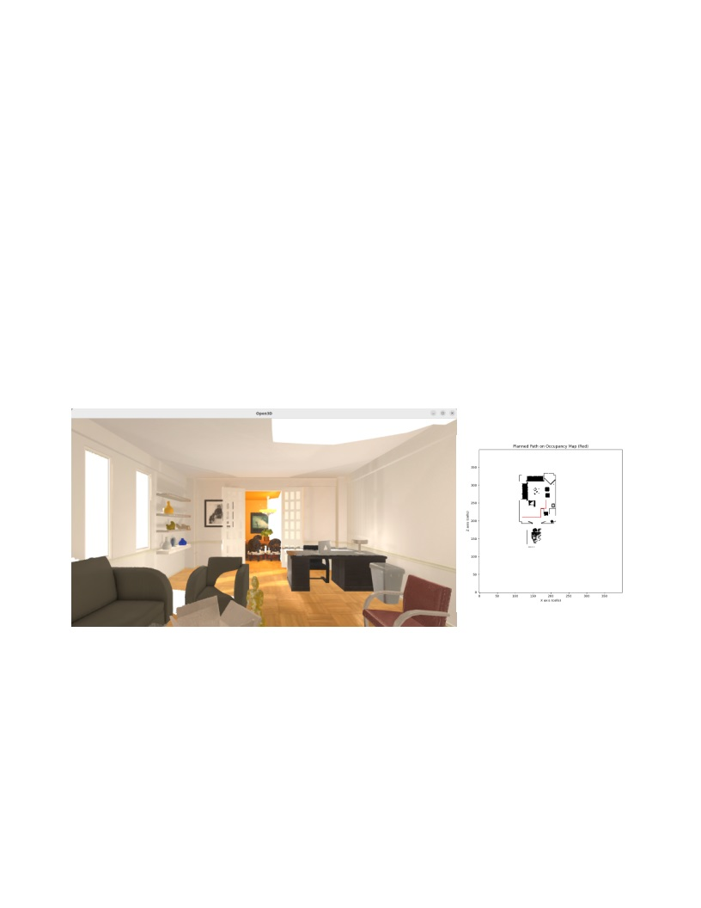
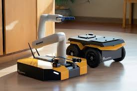
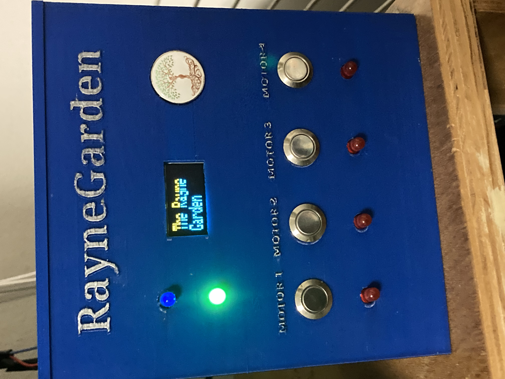
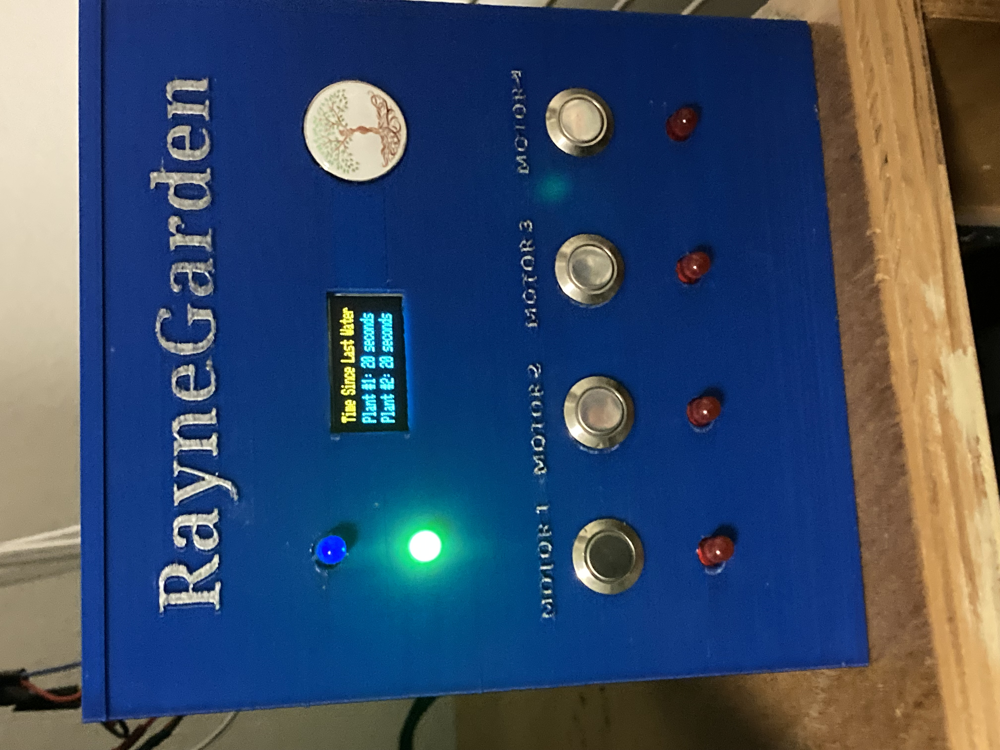
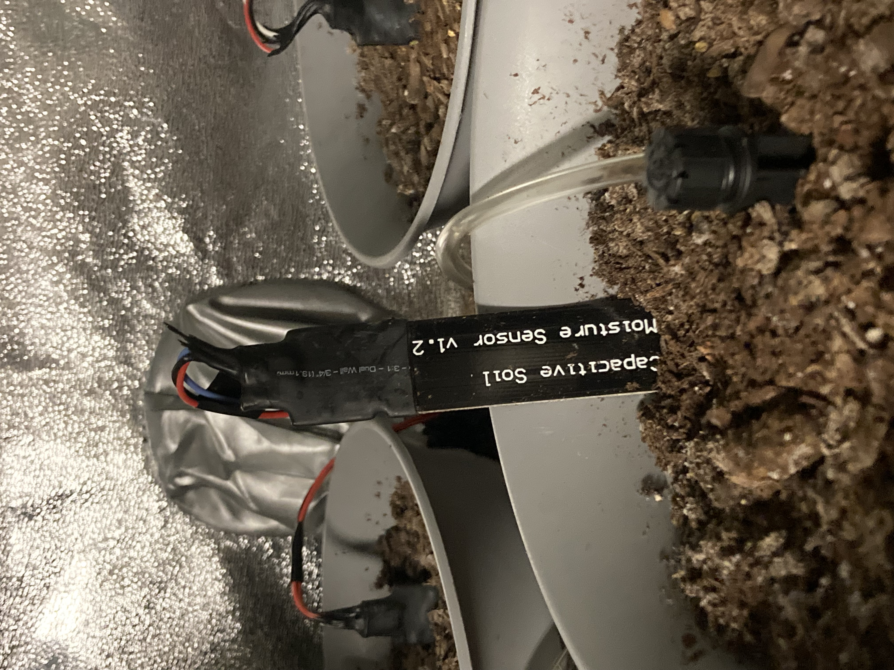

# Jerry Gambrell — Engineering Projects Portfolio

Electrical Engineer and M.S. student in Artificial Intelligence focused on building intelligent physical systems at the intersection of embedded hardware, robotics, and AI.

This repository highlights selected projects spanning embedded systems, robotics, and hybrid intelligent systems, with an emphasis on real-world deployment, system integration, and applied research.

---

## 🔗 Links
- LinkedIn: https://www.linkedin.com/in/jerry-gambrell/
- Resume: [ADD PDF LINK HERE]

---

## ⭐ Featured Projects

### 🔹 VLM-Guided Robot Navigation (Embodied AI Research)
 Development of an embodied AI system enabling robots to interpret and interact with real-world environments using vision-language models.

- Integrated VLM/LLM reasoning, CLIP-based object localization, and ROS2/Nav2 navigation
- Designed for interaction-aware navigation in environments where traditional planners fail
- Evaluated across simulation (Isaac Sim) and real-world robotic systems
- Research contributing to a paper accepted to CVPR 2026 (extended work submitted to IROS)

---

### 🔹 Operant Conditioning System
 Automated system for behavioral research in biological experiments.

- Designed embedded system for behavioral tracking and stimulus delivery
- Scaled from single prototype to 10-unit deployable system
- Improved consistency and automation of experimental data collection
- Presented at university research symposium

---

### 🔹 JOY Smart Car Seat
 Multi-sensor safety system designed to prevent child endangerment scenarios.

- Integrated temperature, gas, moisture, and occupancy sensing
- Implemented GSM-based communication (SIM7000G) for real-time SMS alerts with GPS location
- Local alerting via buzzer and LED
- End-to-end embedded system design and validation

---

### 🔹 Personal Monitoring System
- Distributed multi-node wearable monitoring system (wrist, leg, display)
- Real-time motion data acquisition using embedded sensors
- RF-based wireless communication between independent modules
- Modular design enabling scalable and extensible sensor integration

---

### 🔹 Automated Halloween Candy Bowl
- Interactive embedded system using sensor-triggered automation
- Event-driven logic for responsive user interaction
- RF-enabled communication for coordinated behaviors
- Designed for customizable and expandable effects

---

## 📂 Project Index
[jump to project list](#List-of_Projects)

---

# List of Projects:

## University-Related:
- [VLM-Guided Robot Navigation](#Masters-Thesis-Unblocking-Robot-Navigation-in-3D-Indoor-Spaces-with-Vision-Language-Models)
- [Autonomous Substation Inspection Robot Model](#Autonomous-Substation-Inspection-Robot-Model)
- [Operant Conditioning System To Test Auditory Perception of Songbirds](#Operant-Conditioning-System-To-Test-Auditory-Perception-of-Songbirds)
- [Smart Car Seat](#Smart-Car-Seat)
- [Medical Alert Device](#Medical-Alert-Device)

## Personal Projects:
- [Consumer Product Prototype](#Consumer-Product-Prototype)
- [Johnny 2 and Johnny 1 Custom Robotics Platforms](#Johnny-2-and-Johnny-1-Custom-Robotics-Platforms)
- [Automated Halloween Candy Bowl](#Automated-Halloween-Candy-Bowl)
- [Smart Gardening System](#Smart-Gardening-System)

---

# Project Overviews:

## VLM-Guided Robot Navigation

### Overview:
Embodied AI system combining perception, reasoning, and navigation.

### Key Contributions:
- ROS2/Nav2 + VLM/LLM integration
- Real + simulated deployment (Isaac Sim)
- Interaction-aware navigation

---

## Operant Conditioning System to Test Auditory Perception of Songbirds

### Overview:
Research system designed to automate behavioral experiments in songbirds.

### Key Contributions:
- Capacitive sensing for improved accuracy over IR systems
- Multi-unit system supporting 10 concurrent devices
- Automated data collection and training modes

 

---

## Autonomous Substation Inspection Robot Model

### Overview:
Autonomous inspection robot for hazardous environments.

---

## Smart Car Seat

### Overview:
Embedded safety system for detecting dangerous in-vehicle conditions.

### Key Contributions:
- Multi-sensor safety monitoring
- SMS + GPS alerting system
- Improved reliability over prior designs

---

## Medical Alert Device

### Overview:
Wearable embedded system for monitoring vital signs.

---

## Consumer Product Prototype

### Overview:
Embedded system prototype developed under real-world constraints.

---

## Johnny Robotics Platforms

### Overview:
Custom robotics platforms for ROS-based experimentation.

---

## Automated Halloween Candy Bowl

### Overview:
Interactive embedded system with sensor + RF-based automation.

---

## Smart Gardening System

### Overview:
Automated watering system using sensor feedback.

 &nbsp; &nbsp; &nbsp; &nbsp; 

