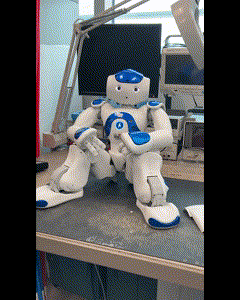

# jg-projects

[jump to project list](#List-of_Projects)

## About me
My name is Jerry Gambrell, and I am currently a graduate student at Florida Atlantic University in the Master's of Science in Artificial Intelligence program. I recently graduated from FAU with a Bachelor's in Electrical Engineering (December '24), and also hold an advanced degree and certification in Psychology and human behavior. Although my primary areas of interest lie in robotics and embedded systems design, I have completed undergraduate and graduate coursework in areas such as Circuit Analysis, Control Systems, Electronics, Sensor Networking and Smart Systems, Logic Design, and Tissue Engineering. Additionally, I took a "project-based" approach to my education, volunteering for research projects whenever possible; while also exploring several interesting personal projects related to embedded systems and robotics in my free time. As a result, I also have experience in circuit board design, SMD soldering, 3-D modeling and printing, and general protoyping of electronic devices. My long-term goal involves eventually combining my knowledge of technology and human behavior to develop products that will enhance the lives of the average person.

## About this repository
This repository is a compilation of embedded systems, robotics, and machine learning projects that have been completed over the past four years for engineering/computer science coursework, or as personal pursuits. It is meant to provide some insight into the various projects which I have undertaken, and the skills and techniques that were used in order to complete them. Projects will be divided into two categories: Those that are university-related (as part of academic coursework or volunteer project), and those completed as personal projects or as an independent contractor.
   

# List of Projects:

## University-Related:
- [Operant Conditioning System To Test Auditory Perception of Songbirds](#Operant-Conditioning-System-To-Test-Auditory-Perception-of-Songbirds)
- [Smart Car Seat](#Smart-Car-Seat)
- [Masters Thesis: Unblocking Robot Navigation in 3D Indoor Spaces with Vision-Language Models](#Masters-Thesis-Unblocking-Robot-Navigation-in-3D-Indoor-Spaces-with-Vision-Language-Models)
- [Autonomous Substation Inspection Robot Model](#Autonomous-Substation-Inspection-Robot-Model)
- [Medical Alert Device](#Medical-Alert-Device)

## Personal Projects:
- [Consumer Product Prototype](#Consumer-Product-Prototype)
- [Johnny 2 and Johnny 1 Custom Robotics Platforms](#Johnny-2-and-Johnny-1-Custom-Robotics-Platforms)
- [Automated Halloween Candy Bowl](#Automated-Halloween-Candy-Bowl)
- [Smart Gardening System](#Smart-Gardening-System)
 

# Project Overviews:

## Operant Conditioning System to Test Auditory Perception of Songbirds
### Description:
 
This project was completed as a volunteer research assistant working directly with the Biology Department at FAU. The goal was to improve the efficiency of research by designing a custom, semi-autonomous operant conditioning system capable of presenting auditory stimuli to subjects (songbirds), while sensing and logging subject’s resulting behavior (frequency and duration of perching).  This model improves upon other versions, that use infrared sensors and trigger switches attached to perches to capture behavioral data, by using an innovative sensing technique for capturing data based on capacitive touch which is more accurate and avoids many of the pitfalls associated with using other methods.  A “tutoring mode” was also added for subject training with non-contingent stimuli. Initially developed as a single-unit prototype, the current version utilizes a single laptop as a hub for interfacing with up to 10 units simultaneously. The system was presented and demonstrated at the university's annual research symposium, and is currently undergoing testing of functionality and reliability with songbirds.
    

<!--   NOT USED BECAUSE NEED TO CHANGE PIC SIZE AND MUST USE HTML FOR THAT-->

   

 

### Hardware:
ESP32, USB audio interface, SD card reader, MP3 player component, wireless audio transmitter, capacitive touch sensor
### Software:
Arduino IDE, Processing IDE, audio processing software, Google Sheets
### Relevant Skills/Methods:
MCU, PCB design, PCB fabrication (LPKF ProtoMat S63), 3D printing, CAD design, UART, I2C, SPI communication protocols, Bluetooth communication protocol
 

[jump to project list](#List-of-Projects)
  

## Smart Car Seat
### Description:
 
This design was part of a group project for a graduate Embedded Systems Design course, and involved designing and implementing a device that could recognize when a child is left alone in a car. It functioned to automatically sound an alarm to inform the guardian or bystanders if the temperature inside of the vehicle reached dangerous levels, while also sending a text message alert to the driver. We chose to expand and enhance the work of Chao Li & Doreen Kobelo (2020), whose study, "Design of a Smart Car Seat to Prevent Heat-Related Deaths of Children Left Alone Inside Cars," formed the basis of our implementation. However, our objective was to improve and build upon their methodology in order to produce a more dependable and effective solution. This project is complete and research paper submitted to the university.
  

 

 

### Hardware:
ESP32, Useful Person Sensor, force sensor, temperature sensor
### Software:
Arduino IDE, MIT App Inventor
### Relevant Skills/Methods:
MCU, UART, I2C communication protocol, mobile app creation, Bluetooth and WiFi wireless communication protocol
 

[jump to project list](#List-of-Projects)
  

## Masters Thesis: Unblocking Robot Navigation in 3D Indoor Spaces with Vision-Language Models
### Description:
 
This project focuses on building a mobile robot with a manipulator that can navigate complex indoor spaces using both traditional path planning and high-level reasoning. While it follows planned routes, the robot can also handle unexpected challenges—like closed doors or elevators—by using a vision-language model to understand its surroundings and decide what actions to take. With its manipulator, the robot can physically interact with the environment, such as pressing buttons to open doors. Simulation will be used alongside real-world testing to develop and refine the system in a range of environments. The project is ongoing, and is part of a master's thesis in Artificial Intelligence.
  

 

 

### Hardware:
Nao v5
### Software:
Python, ROS, Linux, ROS-LLM, AI2THOR, Habitat-sim, Open-Whisper AI, ChatGPT
### Relevant Skills/Methods:
Autonomous navigation, ROS, LLM/LVM, multiple mobile robotics platforms, manipulators, path optimization, Embodied AI, HRI
 

[jump to project list](#List-of-Projects)
  

## Autonomous Substation Inspection Robot Model
### Description:
 
This model was completed to fulfill requirements for Senior Engineering Design I and II coursework. Here we sought to implement an autonomous robot model that could map areas of reasonable size, navigate areas of concern, and collect/display positioning and thermal data. The purpose was to model a device that could navigate dangerous areas (such as a typical power substation), providing routine inspections that would identify any areas in need of maintenance, with the ultimate goal of preventing costly repairs or eqipment loss in the future. We were provided with two robot platforms for development. The first was the iRobot Create3 educational platform, and the second was the larger and more robust Clearpath Husky Platform that are currently being employed in power substations and other dangerous areas. Given that all group members were relatively new to robotics and the ROS software framework, tasks focused on learning how to install and navigate the software, model robot functionality in simulators, and work with the relevant libraries and packages for accessing sensor data and mapping/navigation using physical robot bases.
   

<!-- ****************** Resizing a video may not be possible in this format, but may be able to resize a gif *********************-->

   

   

   

   

### Hardware:
Clearpath Husky robotics platform, iRobot Create3 robotics platform, Raspberry Pi 4, 2D lidar sensor
### Software:
ROS2 Humble (navigation stack), Python, Linux
### Relevant Skills/Methods:
Autonomous navigation, ROS, Path optimization, Sensors (LiDar, wheel encoders), SLAM
 

[jump to project list](#List-of-Projects)
  

## Medical Alert Device
### Description:
 
This design was part of a group project for an undergraduate Embedded Systems Design course. The project parameters were to design and implement an effective system to monitor an individual's pulse and body temperature, with both audio (buzzer) and visual (leds) notifications provided if measurements are outside a preset range. The system was also required to monitor body position (standing, sitting, walking), and transmit that data to a monitor for viewing. We chose to attach our device to the user's wrist and thigh using elastic bands designed for that purpose.
   

<!-- ****************** Resizing a video may not be possible in this format, but may be able to resize a gif *********************-->

<!--  -->

   

   

   

### Hardware:
ESP32, pulse sensor, accelerometer, temperature sensor
### Software:
Arduino IDE, Flashprint
### Relevant Skills/Methods:
MCU, UART and I2C communication protocols, 3d printing, CAD design, WiFi wireless communication protocol
 

[jump to project list](#List-of-Projects)
  

## Consumer Product Prototype
### Description:
 
This project was completed for a small private company seeking university students to act as independent contractors, designing and implementing prototypes of their consumer product concept. Due to active patents on the device, only general information will be shared in this post. The product is divided into two seperate battery-powered components that must communicate wirelessly over short distances. Device specs require that all devices have the ability to pair seamlessly with each other without hard coding of mac addresses, and only allow one unit to pair with another at one time. The device grants the user control over on-board lights, switches, and motors, but must be able to fit within an area no more than 30 cm^2. Consultation with the client was a major aspect of this project as frequent communication about design changes and supply needs was essential. At this point in time, the protype has been completed per the client's specifications, and the final product delivered.
  

### Hardware:
Microcontroller, DC motor, SMD components
### Software:
Arduino IDE, KiCad, Flashprint
### Relevant Skills/Methods:
MCU, PCB design, PCB fabrication (LPKF ProtoMat S63), 3D printing, CAD design, UART and I2C, communication protocols, WiFi wireless communication protocol, SMD soldering, client consultation, BOM
 

[jump to project list](#List-of-Projects)
  

## Johnny 2 and Johnny 1 Custom Robotics Platforms
### Description:
 
The initial Johnny 1 model robot was assembled prior to starting coursework in robotics, and closely followed online and video tutorials for building a robot platform and modeling it using the ROS framework. However, its usage was limited to teleoperation (Xbox remote), using ROS as the motor controller and using Raspberry Pi 4 GPIO to send signals to the motor driver. A Picam and 2D lidar were included to explore procedures for collecting and displaying sensor data. The Johnny 2 model was a significant upgrade in that it used a microcontroller for motor control, communicating with ROS to receive higher-order commands via ROS topics. Another improvement was the addition of a depth camera, which allowed for some exploration of computer vision applications such as visual SLAM techniques and object recognition. This upgrade was completed under the constraint of using only a single power source; as well as the inclusion of a touchscreen for viewing output and to add some personality.
   

<!-- ****************** Resizing a video may not be possible in this format, but may be able to resize a gif *********************-->

   

   

   

   

   

### Hardware:
Arduino Nano, Raspberry Pi 4, PiCam, Luxonis Oak-D depth camera, ultrasonic sensor, 2D lidar sensor, LM386 motor driver, LCD touchscreen
### Software:
Arduino IDE, ROS2 Humble, Linux, sensor libraries, Flashprint
### Relevant Skills/Methods:
Autonomous navigation, ROS, Sensors (RGB and depth camera), Visual SLAM, 3D modeling and printing, robot assembly and modeling, Raspberry Pi

 

[jump to project list](#List-of-Projects)
  

## Automated Halloween Candy Bowl
### Description:
 
This project was conceptualized by my elementary school-aged daughter, with the aim of implementing a halloween candy bowl that could be left out for trick-or-treaters with the ability to limit the amount of candy that was taken at once. Due to the imprecise nature of basic force sensors, a load cell scale with 3-D printed structure was used to track the weight of the candy for determining the quantity and detecting if one, or more than one, piece of candy had been removed at one time. To discourage trick-or-treaters from taking more than one piece of candy at a time, a hidden wireless speaker delivered a message chastizing their gluttony and threatening them with electrocution via "electric spider" if the extra candy was not immediately returned to the bowl. If no change to the weight of the candy bowl was detected in the next several seconds, audio of an "electric shock" sound was played to the wireless speaker, and an a 433 MHz transmitter sent a message to a digital switch controlling the lights on a large spider web (replete with large fake spider), causing them to blink on and off rapidly.
   

<!-- ****************** Resizing a video may not be possible in this format, but may be able to resize a gif *********************-->

<!-- Video clipped video that is in image folder of halloween bowl (dragged and dropped) -->
https://github.com/user-attachments/assets/aecadc69-6d58-4a7f-9522-04b8eed776f0

   

   

### Hardware:
ESP32, load cell sensor, MP3 player module, 433MHz transmitter and receiver, wireless audio transmitter, wireless digital switch
### Software:
Arduino IDE
### Relevant Skills/Methods:
3D modeling and printing, MCU, CAD design, UART and I2C communication protocols, RF communication protocol
 

[jump to project list](#List-of-Projects)
  

## Smart Gardening System
### Description:
 
This project was also inspired by my daughter, who loves to garden. It is a prototype of an automated gardening device that measures the moisture level of one of four potted plants, outputs this value to an OLED monitor, and provides a small quantity of water to the plant if the moisture level does not meet a preset threshhold. The fully-functioning device also tracks the time since each plant was last watered, and uses an innovative and attractive touch button interface ("Tree of Life") to wake the display and perform some simple functionality. 
  

 

 

 

 

### Hardware:
ESP32, capacitive soil moisture sensors, water pumps
### Software:
Arduino IDE
### Relevant Skills/Methods:
PCB design, 3D modeling and printing, MCU, CAD design, UART and I2C communication protocols, WiFi communication protocol
 

[jump to project list](#List-of-Projects)
  
